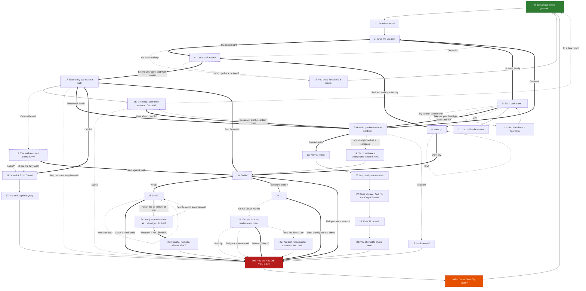

# Story graph (`data/nodes.ts`)

Full visualization of every node in `data/nodes.ts` and every edge between them. Regenerate/update this by hand whenever nodes are added, removed, or rewired - it's meant to be a living reference for spotting soft-locks and dead loops before they ship, not a build artifact.

## Legend

- **Solid thick arrow (`==>`), labeled** - a repeatable option (`eliminatesOnClick: false`). Can be clicked forever.
- **Dotted arrow (`-.->`), labeled** - a one-shot option (`eliminatesOnClick: true`). Once clicked, it's gone for the rest of the session.
- **Thin plain arrow (`-->`), unlabeled** - clicking the node's title/notice (`notice.nextNode`). Always available, no player choice involved.
- **Dashed node border** - a self-looping node (`notice.nextNode` equals its own key). Per the `selfLoopingNodesRetainAnEscape` check in `getNodes()`, every dashed node must keep at least one thick (`==>`) outgoing edge, or the player can get soft-locked once every option is eliminated.
- **Green** - the start (node 0). **Red** - death (999). **Orange** - game over / restart (9999).

When adding new nodes: watch for two nodes that only ever point back at each other with no third way out (a repeatable 2-cycle) - that produces the "same prompt forever" bug that was fixed for nodes 7/13 and 17/18. A node is safe as long as it always has a path toward 999, even if that path is long.

